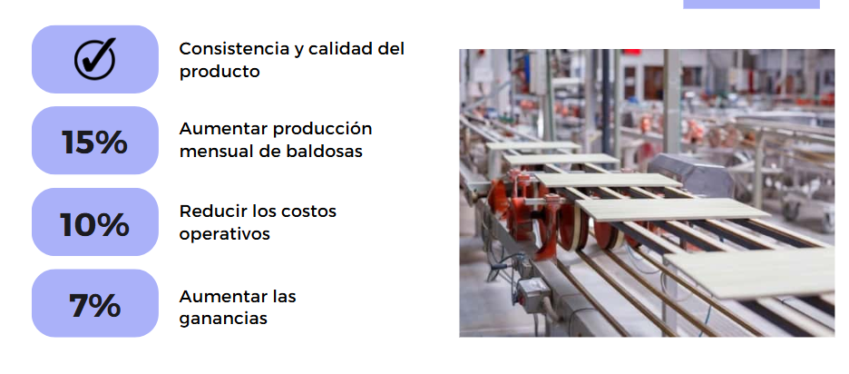

# PLANEACIÓN Y GESTIÓN

## Objetivos y metas

**Objetivo general:** Automatizar una planta de manufactura de baldosas cerámicas que permita la fabricación de tres productos diferentes, mejorando la eficiencia y flexibilidad del proceso.

### Objetivos del Proyecto

* Aumentar la producción mensual de baldosas cerámicas en un 15%.
* Mejorar la eficiencia del proceso de producción para reducir los costos operativos en un 10% y aumentar la rentabilidad en un 7%.
* Garantizar la consistencia y calidad del producto final para cumplir con los estándares del mercado y las expectativas de los clientes.

{width=80%}

## Descripción del proceso previo a la intervención

Para mayor detalle sobre el funcionamiento del proceso remitirse a [descripción del proceso productivo previo a la intervención](../producto/1-analisis-disenio.md#descripción-del-proceso-productivo-previo-a-intervencion)

## Alcance del proyecto

Podemos definir el alcance del proyecto a partir de los siguientes componentes:

### Alcance funcional

El proyecto se centrará en la automatización de subprocesos específicos, como el transporte, atomizador de secado, prensado, secado, esmaltado, decoración, cocción y empaquetado, para una línea de producción de baldosas cerámicas con 3 tipos de esmalte: azulejos con **tamaño de 20x20 centímetros** y un **grosor de 6 milímetros**, con esmalte clase 1, 2 y 3 como está establecido en la [definición de producto](../producto/2-definicion-de-productos.md). También se diseñará un sistema de supervisión y control del proceso de manufactura, se realizará la instalación de las mejoras realizadas y se conectarán con otros dispositivos y sistemas de manera segura a través de internet. No se incluirán otros procesos no mencionados en esta lista.

### Alcance tecnológico

La automatización se basará en tecnologías disponibles y probadas, con énfasis en la integración de sistemas de control y sensores para monitorear y controlar variables críticas en cada subproceso, desde la implementación de los sistemas de control automatizado hasta su puesta en marcha y validación, incluyendo la programación de lógica de control para los subprocesos identificados que así lo requieran.

### Alcance geográfico

Se trabajará exclusivamente en un entorno de gemelo digital, sin implementación física en fábrica.

### Alcance de recursos

Se utilizarán los recursos disponibles dentro del presupuesto asignado para el proyecto, incluyendo equipos, software, personal y el tiempo de implementación indicado en el cronograma.

### Compatibilidad con equipos existentes

La automatización propuesta deberá ser compatible con los equipos y sistemas existentes en la planta de producción.

### Seguridad y regulaciones

La implementación de la automatización deberá cumplir con todas las normativas de seguridad laboral y regulaciones ambientales aplicables.

## Propuesta 

Para mayor detalle sobre la propuesta de automatización remitirse a [propuesta de automatización](../producto/4-propuesta.md)

## Exclusiones

Dentro del proyecto

* No se incluye la automatización de otros procesos no mencionados, como la preparación de materias primas.
* No se considera la implementación de sistemas de automatización para áreas no relacionadas con la producción de baldosas cerámicas.
* No se abarca la capacitación del personal en el uso y mantenimiento de estos sistemas.

El alcance del proyecto incluirá el diseño, desarrollo, implementación y puesta en marcha de los sistemas automatizados en cada subproceso identificado. Se buscará mejorar la eficiencia, la calidad y la consistencia en la producción de baldosas cerámicas mediante la automatización de procesos clave.

### Metas de eficiencia

* Reducir el tiempo de ciclo del proceso de producción en un 13%.
* Lograr una utilización de equipos del 85% o más.
* Optimizar el consumo de energía durante el proceso de producción para reducir los costos operativos en un 10%.

### Metas de calidad

Reducir la tasa de productos defectuosos por debajo del 2% al finalizar el primer año de implementación del proyecto.
Asegurar la uniformidad del producto final para garantizar que todas las baldosas cerámicas cumplan con las especificaciones de tamaño, grosor y acabado.

Asegurar la consistencia en la absorción de agua de acuerdo con los estándares establecidos para cada tipo de baldosa cerámica.

## Recursos

### Recursos financieros

* **Presupuesto para Implementación:** Fondos necesarios para adquirir equipos, materiales y software requeridos para la automatización del proceso de producción.
* **Fondos para Capacitación:** Recursos destinados a la capacitación del equipo en el uso de nuevas tecnologías y herramientas relacionadas con la automatización.
Reserva para Contingencias: Fondos adicionales destinados a cubrir gastos imprevistos o cambios en los requisitos del proyecto.
+ **Costos Operativos:** Fondos necesarios para cubrir los costos operativos del proyecto, como electricidad, mantenimiento y otros gastos misceláneos.

### Recursos humanos y capacitación

* *Equipo de implementación:* Ingenieros mecatrónicos en formación con habilidades en diseño, programación, electrónica y automatización industrial.
* *Supervisores del proyecto:* Será necesario contar con la supervisión y orientación de profesores con experiencia en áreas relacionadas, quienes guiarán y supervisarán el progreso del proyecto.
* *Capacitación en nuevas tecnologías:* El equipo de estudiantes necesitará capacitación en el uso de tecnologías específicas, como software de diseño CAD, software de control de procesos, y sistemas de automatización.
* *Desarrollo de habilidades blandas:* Se requerirá capacitación adicional para desarrollar habilidades de trabajo en equipo, gestión de proyectos, resolución de problemas y comunicación efectiva.
* *Capacitación en seguridad:* Programas de capacitación en seguridad laboral y manejo de equipos de automatización para garantizar un entorno de trabajo seguro.
* *Asistencia técnica:* Posibilidad de contar con asistencia técnica externa para resolver problemas técnicos complejos o para optimizar el funcionamiento de los sistemas automatizados.

<!--
resultados, análisis y estadísticas

-->