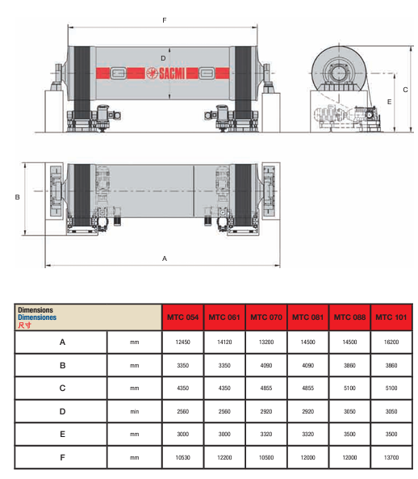

# Analisís y  diseño

## Descripción del proceso productivo previo a intervencion

El proceso de la producción de baldosas cerámicas consta de las siguientes etapas:

## Molienda

En el proceso de molienda, las materias primas (arcilla 40-60%, feldespatos  20-30%, arenas 10-20% , carbonatos 5-10% y caolines 1-5%) se dosifican en proporciones específicas y se introducen en el molino MTC 041 [[1](#referencias)].

Dentro del molino, estos materiales se mezclan con agua y defloculantes, resultando en la formación del slurry, un compuesto líquido crucial para la fabricación de azulejos. La automatización de este proceso implica varios componentes y técnicas avanzadas.
Las materias primas se transportan mediante un sistema de bandas transportadoras. Cada banda transportadora se ajusta individualmente para controlar la velocidad, lo que permite dosificar con precisión las proporciones de cada material. Estas bandas convergen en una banda transportadora común que lleva los materiales mezclados hacia el molino. Dentro del molino, un sensor de humedad infrarrojo mide continuamente el contenido de humedad del slurry. Este sensor emite datos en tiempo real a un sistema de control automatizado. Basándose en estas mediciones, el sistema ajusta una válvula de control de agua para mantener la humedad del slurry dentro de los parámetros especificados. Este ajuste se realiza mediante un actuador que regula la apertura y cierre de la válvula, asegurando una adición precisa de agua.

{width=60%}

| dimension | units   | MTC-035 | MTC-041 |
|-----------|---------|---------|---------|
| A         | mm      | 10935   | 12230   |
| B         | mm      | 3570    | 3570    |
| C         | mm      | 4070    | 4070    |
| D         | mm      | 2200    | 2200    |
| E         | mm      | 2900    | 2900    |
| F         | mm      | 9255    | 10550   |

{width=60%}
> tomado de [2]

La densidad de las barbotinas varía de 1690 a 1740 g/l 

### Atomizador de secado
En la actualidad, muchas empresas utilizan dispositivos de medición por infrarrojos junto a un muestreador de polvo secado por aspersión para controlar el contenido de humedad del polvo; sin embargo, pocas empresas utilizan esta señal para completar el circuito de control, y no sólo medir sino también controlar la humedad. Se considera necesario cerrar el bucle de control. 

Respecto al caudal de suspensión, se encontró que, aunque la medición de la variable se encuentra automatizada, la manipulación de ésta se realiza de manera manual. Se considera necesario automatizar la manipulación de ésta.

### Prensado 

Control automático de la medición y manipulación del contenido de humedad en las piezas. 
Bucle de control tomando en cuenta la densidad aparente de las baldosas se considera necesario.

### Secado: 

Manejo automatizado de temperatura y contenido de humedad en las baldosas.

### Esmaltado: 

Controlador del caudal del esmalte.

### Decoración: 

Inspección visual automatizada.

### Cocción: 

Las dimensiones y curvatura de las piezas se miden de forma automática, pero la manipulación de los valores que determinan estas variables es manual. Se propone automatizar la manipulación de éstas. 
Adicionalmente, la inspección visual y control de temperatura del aire del quemador se realizan manualmente. Se propone su automatización.

### Empaquetado: 

El empaquetado ya se encuentra automatizado. Se propone una mejora de éste.	

## VSM

## Cuellos de botella y áreas de mejora 

Entre las 588 muestras obtenidas, los defectos incluyen tipos de grietas (60,9%), esquinas rotas (9,9%), defectos de impresión y decoración (9,4%), bordes rotos (8%), defectos en el esmaltado inferior (5,4%), sombras ( 3,9%) y otros casos (2,6%). Teniendo en cuenta las cuestiones anteriores, se analizó el parámetro de tipos de grietas como la principal causa de creación de defectos en las baldosas, que se asoció con las máquinas de prensado

## Indicadores claves de diseño 

<embed src="/Tile-Tech/KPI.pdf" type="application/pdf" width="100%" height="600px" />

[KPI](/KPI.pdf)

## Modelos usado en el diseño
- caja de empaque tomado de [Cardboard Insert](https://grabcad.com/library/cardboard-insert-1)

## Referencias
1. [Catalogo de molinos SACMI](/Tile-Tech/catalogos/1molienda_catalogo_Molino_MTC_SACMI.pdf)
2. 