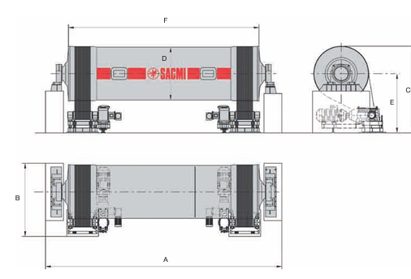
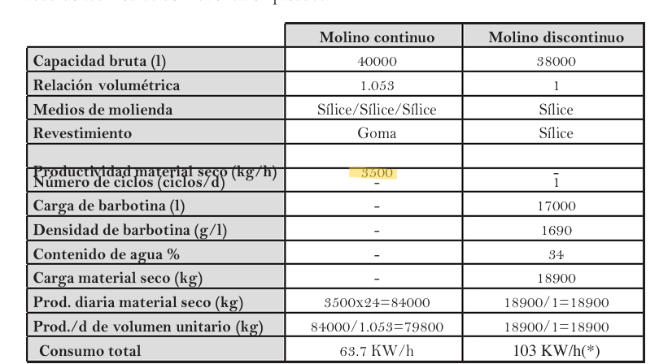
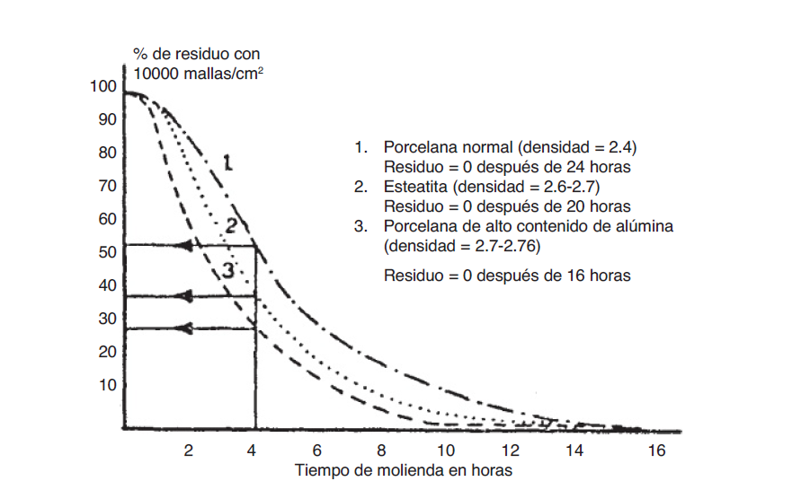
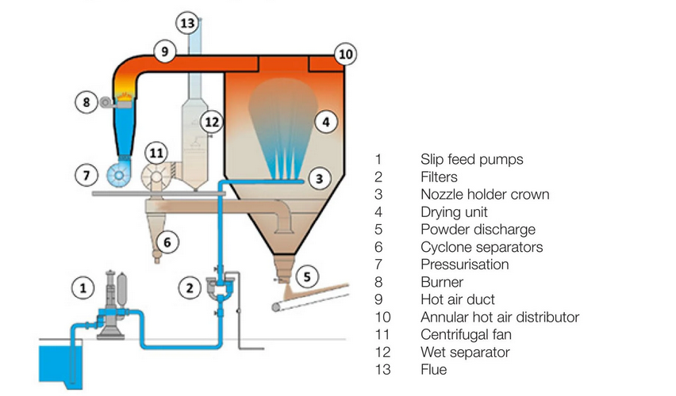
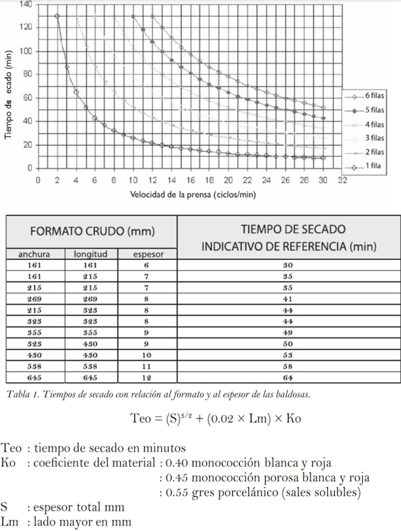
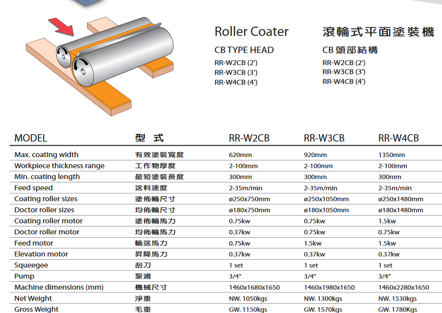
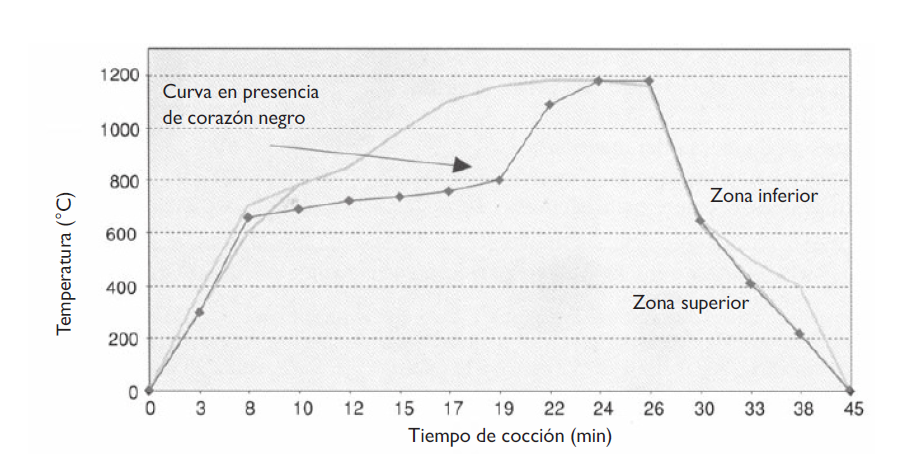
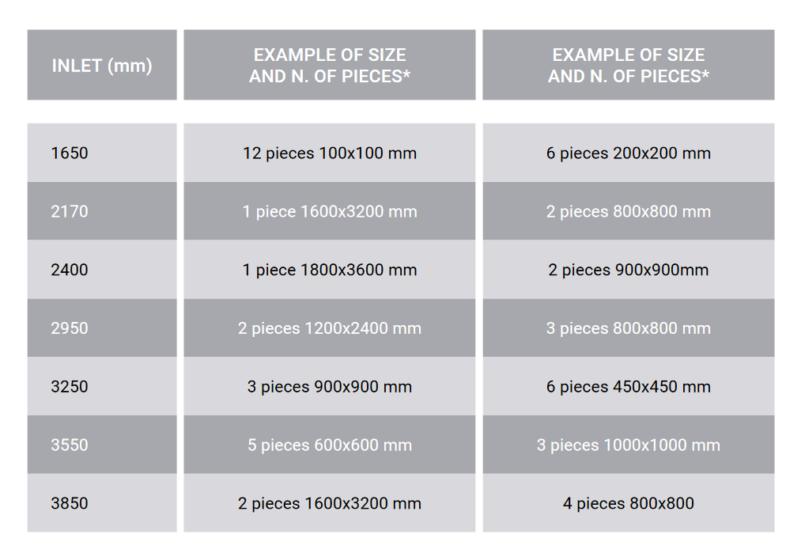
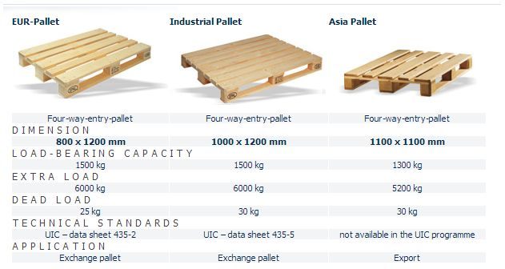
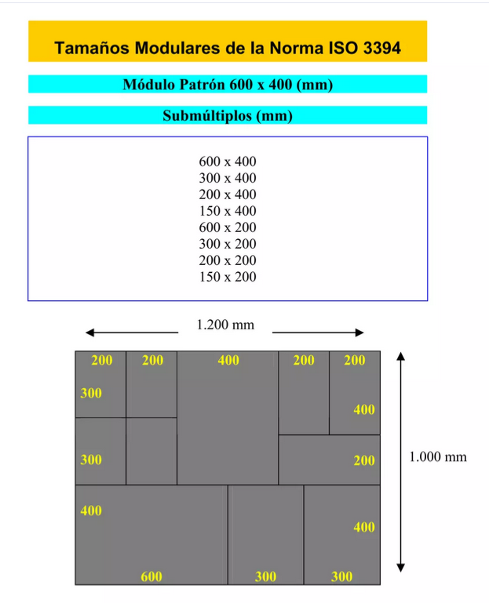

# Análisis para el diseño

## Estado de la planta previo a intervención:

Se tiene que la fábrica opera de manera continua en 3 turnos de 8 horas. Donde se produce en promedio 7000 baldosas/hora con tres tipos diferentes de baldosas en empaques de 25 baldosas.  Estas cajas de baldosas son empacadas en palets de 80 cajas. La producción de los 3 tipos de baldosa se realiza por lotes de 20  palets. Para más detalles sobre las características de las baldosas remitirse a [definición de producto](2-definicion-de-productos.md). La fabrica tiene un area operativa de planta de 250 m de largo y 60 m de ancho (según simulación de tecnomatix).


## Etapas del proceso productivo 

A continuación se describen las etapas del proceso productivo de baldosas cerámicas consta de las siguientes etapas:

### Molienda

En el proceso de molienda, las materias primas (arcilla 40-60%, feldespatos  20-30%, arenas 10-20% , carbonatos 5-10% y caolines 1-5%) se dosifican en proporciones específicas y se introducen en el molino. Dentro del molino, estos materiales se mezclan con agua y defloculantes, resultando en la formación de la barbotina, un compuesto líquido crucial para la fabricación de azulejos. La densidad de las barbotinas se caracteriza por tener una humedad del 34%  y una densidad que varía entre 1690 a 1740 g/l  [[2](#referencias)].


{width=80%}

{width=80%}

| dimension | units   | MTC-035 | MTC-041 |
|-----------|---------|---------|---------|
| A         | mm      | 10935   | 12230   |
| B         | mm      | 3570    | 3570    |
| C         | mm      | 4070    | 4070    |
| D         | mm      | 2200    | 2200    |
| E         | mm      | 2900    | 2900    |
| F         | mm      | 9255    | 10550   |
> Tomado de [1] pag 15

La fabrica cuenta con 2 molinos MTC 041 [[1](#referencias)]. Basado en la tabla de características estándar de un molino y teniendo en cuenta  su capacidad de 40000 litros, se tiene como resultado una producción de 3500 kg/hora de material seco (6700  baldosas).  Esto es equivalente a **5300 kg/h** barbotina con 34% de humedad o **1.473 kg/s** barbortina húmeda por cada molino. Con los dos molinos trabajando a capacidad máxima se tiene un potencial de producción de **13400 baldosas/h** .


{width=80%}
> Tomado de [2] pag 68

Las materias primas se transportan mediante un sistema de bandas transportadoras. Cada banda transportadora se ajusta individualmente para controlar la velocidad, lo que permite dosificar con precisión las proporciones de cada material. Estas bandas convergen en una banda transportadora común que lleva los materiales mezclados hacia el molino.Basado en la gráfica de cantidad de residuos en función del tiempo se tiene que el **tiempo de molienda es de 10 horas**.

{width=80%}
> Tomado de [2] pag 44

### Atomizado

En el proceso de atomización, se inicia con la introducción de la barbotina obtenido del paso anterior en un cilindro cerrado, donde se expulsa mediante aspersión en un entorno controlado con corrientes de aire caliente. Esta operación provoca la reducción de la humedad de la barbotina, llevándolo a un estado sólido. Posteriormente, por efecto de la gravedad, el sólido resultante cae sobre una cinta transportadora que lo dirige hacia el siguiente proceso de fabricación. Se tiene que la planta cuenta con un atomizador ATM036 con una capacidad de producción de polvo atomizado de **8490 kg/hora** de polvo con humedad del 6% que representa 7980 kg/hora de polvo seco (15290 baldosas/hora ) [[3](#referencias)]. Pero se ve limitado por la capacidad del molino.

{width=80%}
> Tomado de [2]

<!---
slip temperature 20 to 70 C
- slip pressure 20-30 bar
drying unit pressure -0.5 to 1.5 mbar
- inflowing hot air temperature 500 to 650 C
- temperature of spry-dried pwoerd 40 to 70 C
- exhuast air intake temperature 90 to 120 C
- flue gas outlet temeprature 60 to 80 C
-->
| DATOS TÉCNICOS                     |     | ATM006  | ATM012    | ATM018    | AMT036    | ATM052    | ATM065    |
|------------------------------------|-----|---------|-----------|-----------|-----------|-----------|-----------|
| Capacidad de evaporación nominal   | l/h | 600     | 1.200     | 1.800     | 3.600     | 5.200     | 6.500     |
| Producción atomizado (@ 34% H2O)   | kg/h| 1.410   | 2.830     | 4.240     | 8.490     | 12.260    | 15.320    |
| Potencia térmica nominal instalada | kcal/h | 540.000 | 1.050.000 | 1.500.000 | 3.000.000 | 4.300.000 | 5.500.000 |
| Temp. aire entrada a torre         | °C  | 500-600 | 500-600   | 500-600   | 500-600   | 500-600   | 500-600   |
| Temp. aire salida                  | °C  | 60-130  | 60-130    | 60-130    | 60-130    | 60-130    | 60-130    |
| Temp. polvo atomizado              | °C  | 40-60   | 40-60     | 40-60     | 40-60     | 40-60     | 40-60     |
| Humedad polvo atomizado            | %   | 4-7     | 4-7       | 4-7       | 4-7       | 4-7       | 4-7       |
| Consumo térmico específico         | kcal/l | 750-850 | 700-850   | 700-850   | 700-850   | 700-850   | 700-850   |
| Número de LANZAS                   | n.  | 3       | 6         | 7         | 9         | 10        | 12        |
| Boquillas - máx. con LANZAS        | n.  | 6       | 12        | 14        | 18        | 20        | 24        |
| Boquillas - máx. con CORONA        | n.  | 6       | 12        | 15        | 20        | 28        | 32        |
| Ciclones separadores               | n°  | 1       | 1         | 1         | 2         | 2         | 2         |
| Potencia eléctrica nominal instalada | kW | 14,0    | 22,5      | 35,5      | 63,5      | 90,0      | 125,0     |


| DATOS TÉCNICOS                              |        | ATM090 | ATM110 | ATM140 | AMT180 | ATM200 | ATM250 |
|---------------------------------------------|--------|--------|--------|--------|--------|--------|--------|
| Capacidad de evaporación nominal (a 0 mslm) | l/h    | 9,000  | 11,000 | 14,000 | 18,000 | 20,000 | 25,000 |
| Producción atomizado (@ 34% H2O)            | kg/h   | 21,210 | 25,930 | 33,000 | 42,430 | 47,140 | 58,930 |
| Potencia térmica nominal instalada          | kcal/h | 7,500M | 9,200M | 11,500M| 15,000M| 16,700M| 21,000M|
| Temperatura aire en entrada a la torre      | °C     | 500-600| 500-600| 500-600| 500-600| 500-600| 500-600|
| Temperatura aire en salida                  | °C     | 60-130 | 60-130 | 60-130 | 60-130 | 60-130 | 60-130 |
| Temperatura polvo atomizado                 | °C     | 40-60  | 40-60  | 40-60  | 40-60  | 40-60  | 40-60  |
| Humedad polvo atomizado                     | %      | 4-7    | 4-7    | 4-7    | 4-7    | 4-7    | 4-7    |
| Consumo térmico específico                  | kcal/l | 700-850| 700-850| 700-850| 700-850| 700-850| 700-850|
| Número de LANZAS                            | n.     | 12     | 13     | 14     | 18     | 18     | 24     |
| Boquillas - número máximo con LANZAS        | n.     | 24     | 26     | 28     | 36     | 36     | 48     |
| Boquillas - número máximo con CORONA        | n.     | 32     | 40     | 48     | -      | -      | -      |
| Ciclones separadores                        | n°     | 2      | 4      | 4      | 4      | 4      | 6      |
| Potencia eléctrica nominal instalada        | kW     | 150.5  | 182    | 230    | 355.5  | 355.5  | 407    |
> Tomado de [3]

 
<!--
>La capacidad de evaporación es el parámetro característico del atomizador que con más inmediatez permite verificar la eficacia y el grado de rendimiento de la máquina, con respecto a su potencial.  
> pag 101 
-->


### Prensado 

En este proceso, el polvo atomizado resultante de la etapa de atomización se distribuye uniformemente en una bandeja, donde se aplica una fuerza entre 340 y 400 kg/cm² mediante una prensa hidráulica. Esta fuerza provoca que la humedad residual en el polvo facilite la formación de la pieza con una forma geométrica específica, en este caso, un cuadrado de 20x20 centímetros. La pieza se conforma mediante la compactación del polvo granulado semiseco. El proceso utiliza una prensa  SACMI PH2090 esta cuenta con un molde para 2 piezas de 60x60. Puede estimarse un area de trabajo util de un 100x60 cm donde se elaboran 15 baldosas por cada ciclo. La prensa realiza 14 ciclos por minuto equivalente a un periodo de **4.29 s por golpe** [[4](#referencias)]. La prensa a su máxima capacidad puede producir 12600 baldosas/hora  que equivalen a un peso aproximado de 6577 kg/hora.

<!---
preprensado: 0.522 kg x 15 u = 7.83 kg/ u golpe 
prensado = 4.29 s/u 
-->

La cantidad de material que entra a la prensa se define a partir del molino quien limita la entrada a 3500 kg/h de material seco alrededor de **3700 kg/h** barbotina con 6% de humedad **1.03 kg/s**. Basado en la ficha técnica de piso pared Egeo blanco de Corona cada baldosa pesa tiene un peso aproximado de 522 g [[5](#referencias)]. Por lo que no trabaja a su máxima capacidad. Basado en la capacidad limitada dle molino se logran producir **7000 baldosas/hora**.


$$ 3700 kg/h/0.522kg = 6704 u/h  $$$

<!--
-->


{width=80%}
> Tomado de [2] pag 166 a 173


### Secado: 

En el proceso de secado se busca eliminar la humedad de las baldosas cerámicas. La cual se reduce de un 6% a un 0.5%. 
Durante el secado se realiza una transferencia de calor desde el ambiente al cuerpo cerámico a secar lo que produce la evaporación del agua.  Los secadores horizontales son de tipo horno monoestrato de rodillos. En este caso las piezas se mueven por encima de los rodillos en horizontal y el aire caliente con el que entran en contacto viene de quemadores que están en los laterales del horno. La temperatura máxima de este tipo de secadores está en los 350oC y los ciclos de secado son menores, entre 15 y 25 minutos. 


{width=80%}

Basado en la ecuación de secado se tiene que el tiempo de secado es de 18 minutos. 

```  
SECADO	
Teo : tiempo de secado en minutos	
Teo = (S)^3/2 + (0.02 × Lm) × Ko	
Ko : coeficiente del material	0.55 gres porcelánico
S : espesor total mm	6,4mm
Lm : lado mayor en mm	200
	
Teo : tiempo de secado en minutos	18.4
```

El secador utilizado es EVA el cual cuenta con 260 canastos los cuales pueden cargar de a 12 baldosas. La velocidad de la banda es de 20 m/min. Se tiene que por cada minuto pasan 60 baldosas por lo que se tiene una producción de **7200 baldosas/hora** equivalente a un takt time de **0.5 seg por baldosa**.
$260*12*60 min/18.4 min = 10170$

### Esmaltado:

El esmaltado es un tratamiento que se utiliza para otorgar una serie de propiedades tecnicas y estéticas como la impermeabilidad, facilidad de limpieza, brillo, color,resistencia química y mecánica etc. El esmaltado se realiza en continuo y los métodos más empleados son: por pulverización, en cortina, en seco o las decoraciones.

El esmaltado cumple tres funciones:
1.	Decora: Se utiliza con objetivo artístico y estético por la variedad de esmaltes disponibles. 
2.	Impermeabiliza: El esmalte sobre la pieza cerámica evita que la humedad penetre en la pieza. 
3.	 Aporta dureza y resistencia a la pieza

Al aplicar las capas de esmalte en el soporte cerámico convierten en un recubrimiento compacto de partículas denominado capa consolidada. La serigrafía es el método más empleado para la decoración de baldosas cerámicas por su facilidad de aplicación en las líneas de esmaltado. Se usa en monococción, bicocción y tercer fuego. Durante el proceso de esmaltado La velocidad de transporte es de aproximadamente 2-25 m/min. Existen varios tipos de esmaltado como lo son campana, hilera, discos rotatorios, aerógrafo y sistemas de goteo. Se establece que el tipo de esmaltadora es por rodillo y se utilizan 2 esmaltadoras RIGMA RR-w2CB. Teniendo en cuenta que la velocidad de la banda es de 15 m/min se establece que por cada minuto pasan 60 baldosas por cada esmaltadora por lo que entre ambas **7200 baldosas por hora** equivalente a  un takt time de **0.5 seg por baldosa**. 

<!---
20m/min*4= 80 baldosas/min
10m/min*4= 40 baldosas/min

-->

```	
f = 4300 u/h 
T = 1/f 
T = 1/(4300 [u/h]) (3600 s/h) 
T = 0.75 s/u
```	



### Cocción:

Dentro del proceso de producción es la etapa más importante ya que es el momento en el que las piezas tienen una gran transformación, dando como resultado piezas con grandes características como resistencia al agua, dureza, facilidad de limpieza, estabilidad dimensional.

Dos variables fundamentales en esta etapa son el ciclo térmico y la atmósfera del horno, que deben adaptarse a las características específicas de cada composición y tecnología de fabricación para obtener el producto cerámico deseado.

La etapa de cocción se divide en dos partes principales: calentamiento y enfriamiento. Durante la etapa de calentamiento, que abarca aproximadamente el 55-60% de la longitud del horno, las piezas se calientan gradualmente hasta alcanzar alrededor de 400°C. Este calentamiento inicial tiene como objetivo eliminar la humedad excesiva y los humos generados durante la combustión. Luego, se produce un aporte energético que facilita la oxidación de la materia orgánica y las impurezas, eliminando los gases generados y descomponiendo los carbonatos presentes en el soporte cerámico.

Es crucial que estas reacciones se completen antes de que la permeabilidad del esmalte y el soporte sea demasiado baja, lo que podría causar problemas como alteraciones de color o textura en las piezas. La etapa de cocción propiamente dicha es donde ocurre la sinterización de las piezas. Durante este proceso, el soporte cerámico experimenta una transformación química, pasando de una mezcla de materias primas a una estructura más compleja, con fases vitreas o cristalinas estables, dependiendo del tipo de composición.

El tiempo necesario en esta etapa es crucial para garantizar la vitrificación completa de la pieza y asegurar su estabilidad dimensional. Las temperaturas alcanzadas pueden oscilar entre 1130°C y 1200°C. Durante esta fase, y al final del calentamiento, las piezas experimentan una importante variación dimensional debido a la dilatación térmica, lo que debe ser considerado en el diseño de la pasta, el englobe y el esmalte para evitar problemas de curvatura en el producto final.

La etapa de enfriamiento, que comprende entre el 40% y el 50% de la longitud del horno, consta de tres etapas distintas: enfriamiento forzado a alta temperatura, enfriamiento natural y enfriamiento forzado a baja temperatura. Durante estas etapas, se utilizan diferentes métodos de enfriamiento para garantizar que las piezas se enfríen de manera controlada, minimizando así la posibilidad de roturas o defectos en el producto final. La transformación alotrópica del cuarzo a 537°C es un aspecto importante que se debe considerar durante el enfriamiento, ya que puede provocar roturas si no se controla adecuadamente.

Las dimensiones y curvatura de las piezas se miden de forma automática, pero la manipulación de los valores que determinan estas variables es manual. Se propone automatizar la manipulación de éstas. Adicionalmente, la inspección visual y control de temperatura del aire del quemador se realizan manualmente. Se propone su automatización.


> Tomado de [2] pag 218

A partir de la grafica del ciclo de calentamiento del horno se sabe que el proceso de cocción dura 45 min.

El horno utilizado es el horno SACMI maestro. Un horno de longitud variable por modulos. Se utiliza una longitud de 160 m y una velocidad de 3.5 m/min.  Se escoje igualmente un inlet 3850 mm y con un numero de piezas esperado de 12 piezas entrando al horno simultaneamente y ingreso de 3 filas de piezas por metro recorrido. Esto resulta en una capacidad de producción  de 4300 baldosas/hora.

$ 14 * 3 * 3.5 m/min (60 min/h) = 8820 u/h$





### Empaquetado:

La clasificación y el embalaje es la penúltima etapa del proceso de fabricación de baldosas cerámicas. Se establece que la planta hace este proceso de forma manual donde la inspección se realiza de forma visual por los operarios los cuales seleccionan y empaquetan 25 baldosas por caja de empaquetado. Los cerámicos se empacan de manera vertical ya que este optimiza la distribución de carga de los productos. Se tiene que la planta produce 294 cajas/hora (7350 baldosas/hora),  4.9 cajas/min equivalente a **12.2 seg por cajas**. En la estación se tienen 4 operarios que realizan el proceso de empaquetado.

<!---
$
 4.9 cajas/min * 25 baldosas/caja  (60 min/1 h) = 7350 baldosas/min
$
-->

### Paletizado:

El ultimo paso del proceso consiste en el al agrupación de cajas de baldosas para formar un paletizado donde se prepara el producto para su transporte. Este proceso se realiza de forma manual a traves de un operario. Se define que se empacan 80 cajas por estiba [[5]].

{width=80%}

Se define que la fabrica utiliza palets universales de 1200X100 mm. Basado en la norma ISO 3394 La cual especifica la medida de las cajas para un uso optimo del espacio. Se utiliza una caja de 200x150x200 mm donde se agrupan en paquetes de 2x4 para formar un modulo patron, acomodando 5 módulos por piso y 2 pisos de altura se tiene 80 cajas por palet y 2000 baldosas por palet. Se tiene una producción de 3.8 palets/hora (7600 baldosas/hora) equivalente a **15 min por palet**.

{width=80%}


<!--
## Selección calificación de baldosas
SYNTHESIS Y GENUSIS

-->


## Referencias

1. Catálogo  de molinos de tambor continuo SACMI. [Catalogo de molinos SACMI](/catalogos/1molienda_catalogo_Molino_MTC_SACMI.pdf)
2. Tecnología cerámica aplicada SACMI, Asociación Española de Técnicos Cerámicos. 2004.[SACMI](https://sacmi.com/)
3. Preparacion de polvos ceramicos atomizacion.[SACMI](https://sacmi.com/es-ES/ceramics/Azulejos/Preparacion-de-polvos-ceramicos/atomizacion/ATM)
4. [Catalogo de prensa SACMI](/catalogos/1prensado_catalogo_prensa_SACMI.pdf) 
5. [ficha técnica Egeo blanco de Corona](/catalogos/1productos_baldosas.pdf)
