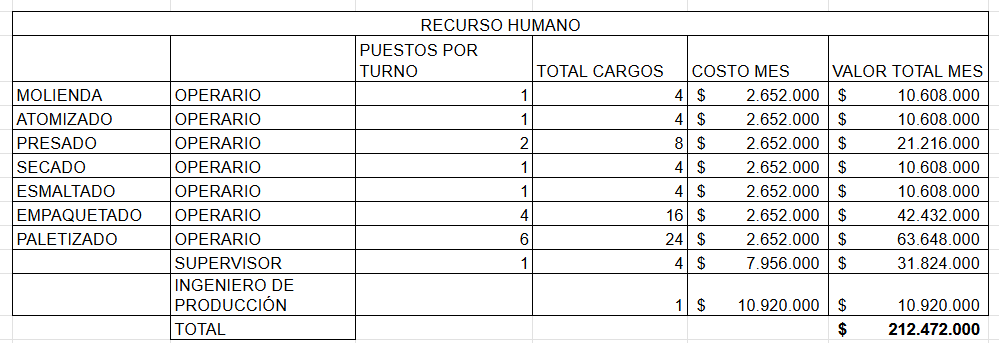

# Análisis económico

El análisis económico se realiza con el fin de determinar la viabilidad del proyecto y evaluar su rentabilidad. Para ello se inicia por determinar el número de baldosas producidas por mes antes de la intervención, basados en la capacidad de producción de la planta y el tiempo de operación establecidos en la [gestión de producción](5-gestion-produccion#cuellos-de-botella-y-áreas-de-mejora).

## Costos de producción

Para determinar los costos de producción se consideran los costos de insumos, mano de obra y otros costos asociados a la producción de baldosas cerámicas.

### Costos de insumos

### Costo recursos Humano
La planta antes de la intervención requiere el siguiente recurso humano. Para cubrir un puesto de trabajo 24 horas se requieren 4 cargos. En el costo mensual de cada cargo se incluye el salario básico más: las prestaciones sociales, los aportes a seguridad social (salud, pensiones y riesgos profesionales); la parafiscalidad (beneficios de caja de compensación familiar, SENA y ICBF); dotaciones y elementos de protección personal según lo establecido en el código sustantivo del trabajo. Estos costos corresponden aproximadamente a un 56% adicional al salario base del trabajador. Causandose un costo mensual de $212.472.000  COP.

Se hace un estimado del costo incurrido por la fabrica de baldosas.

## Costos de inversión

Para ello, se consideran los costos de inversión, los costos operativos, los ingresos esperados y el periodo de recuperación de la inversión.

El producto 1 tiene un valor comercial de $ 30.800 $COP/m^2$  que equivale a $ 1.232 COP/u asumiendo que la fabrica de cerámicas obtiene una ganancia de 7% respecto al precio de venta del producto, se tiene una ganancia de $ 258.720 COP y una ganancia mensual de 130 millones de pesos. 
Con un aumento de 10% en la producción de baldosas. Se tiene un aumento de ganancias 13 millones de pesos mensuales. 

<embed src="/Tile-Tech/analisis-economico.pdf" type="application/pdf" width="100%" height="600px" />

<!---
## modelo de negocio

- Segmentos de mercado: plantas de fabricación de cerámica de tamaño mediano. Que busquen aumentar su producción y requieran de automatización

- Propuestas de valor: servicios de ingeniería. Desarrollo de un proyecto que identifique el proceso de producción actual y proponga una solución de automatización que permita aumentar la producción y disminuir los costos de producción. Seguimiento y mantenimiento del proyecto.

- Canales
pagina web

- Relaciones con clientes

- Fuentes de ingreso: ¿Cuanto esta dispuesto a pagar el cliente? El proyecto se vera financiado por la empresa de cerámicas. Y se desglosara en etapas que se pagaran a medida que se avance en el proyecto.

- Recursos clave:
recursos humanos

- Actividades clave
actividades planteadas por cronograma

- Estructura de costos

proceso de estimación de costos

-->

## BOM
Se anexa el Build of materials (BOM), el cual contiene la lista de los materiales necesarios para la elaboración del proyecto.

## Definiciones

Arancel: Corresponde a la tarifa arancelaria que es el porcentaje que aplica al valor de una mercancía para determinar el impuesto que se debe pagar por concepto de importación. El Código 8479.50.00.00 establece que el pago de la tarifa arancelaria para Robots industriales es del 5%. [1]

IVA Impuesto al valor agregado. Es un impuesto indirecto sobre el consumo se aplica por la compra de bienes o servicios profesionales y es equivalente al 19%.

## Referencias

1. “Cómo consultar el arancel de aduanas”  DIAN Dirección de Impuestos y Aduanas Nacionales. 
Decreto 1881 de 2021 “Por el cual se adopta el arancel de aduanas y otras disposiciones”
2. Ley 1819 de 2016 
