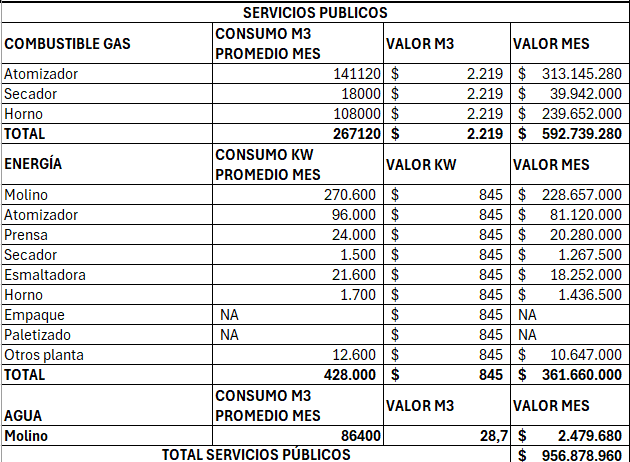
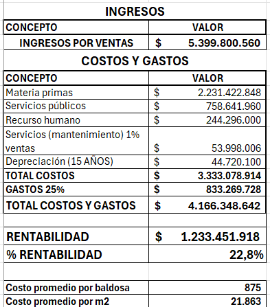
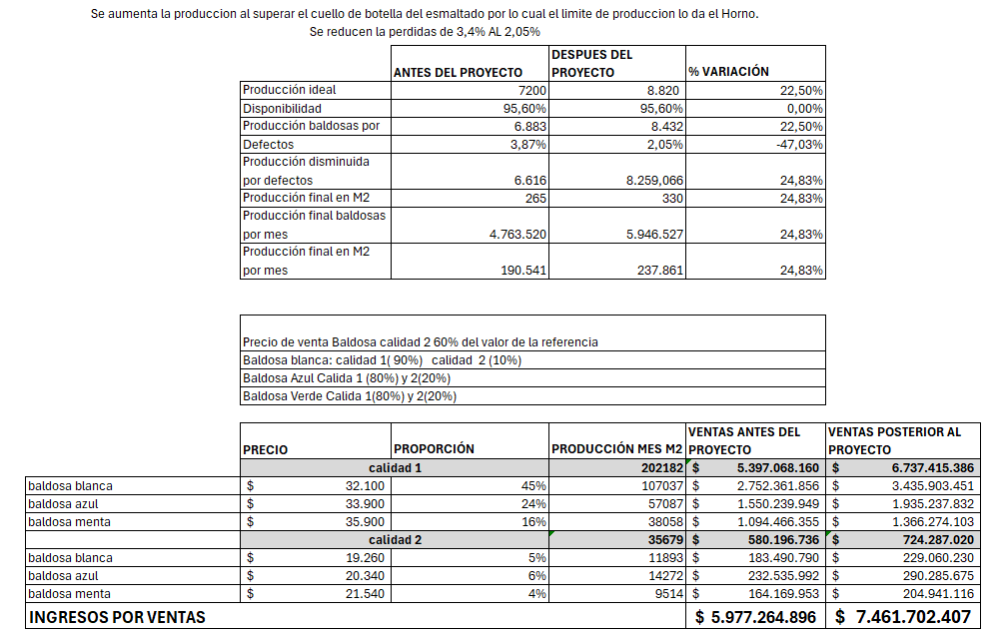
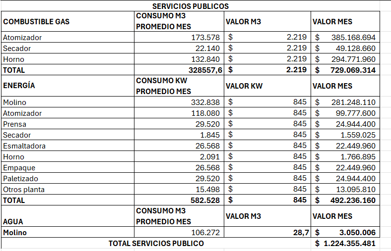
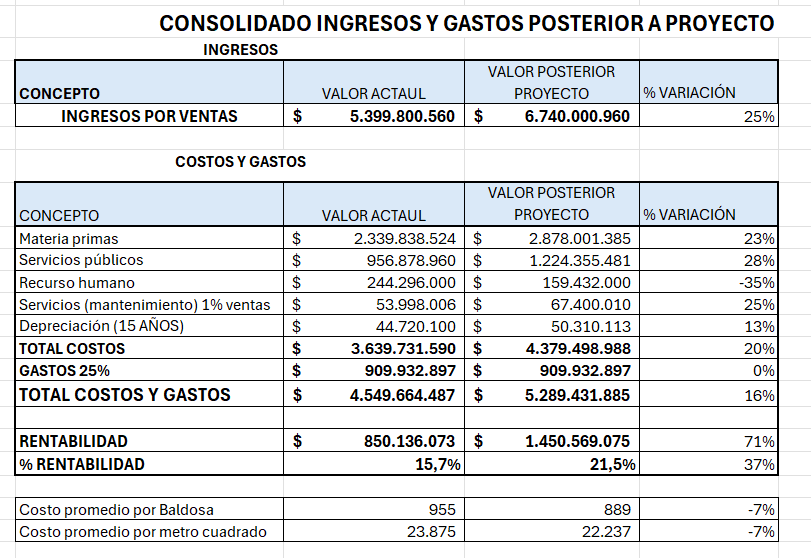
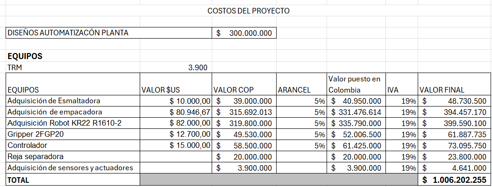
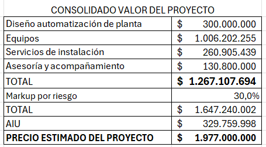
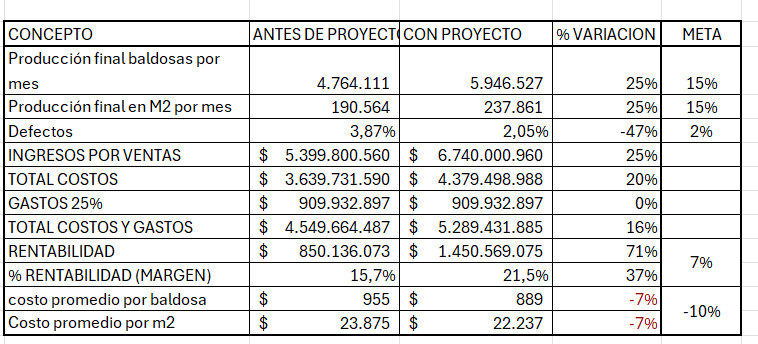

# Análisis económico

El análisis financiero se realiza para determinar la viabilidad y el impacto del proyecto, es decir determinar si los recursos invertidos retornan o se recuperan; si los recursos utilizados en este proyecto generan mayores beneficios que utilizarlos en otros y establecer el impacto del proyecto en la rentabilidad de la planta.

Para el análisis financiero se determinó la capacidad de producción de la planta en su estado actual y la planta posterior a la intervención, el número de metros cuadrados de baldosa que producen, lo que permite determinar los ingresos mensuales por ventas de la empresa. Igualmente se analizaron los costos y gastos de producción, estableciendo la cantidad de materiales que se requieren, el consumo de servicios (agua, energía y gas), los costos de recurso humano y otros costos y gastos operativos.

## Antes de intervención

Se inicia por hacer un estudio y determinar como era la situación de la fábrica antes de la intervención. El número de baldosas producidas por mes antes de la intervención es establecido en la [gestión de producción](5-gestion-produccion#cuellos-de-botella-y-áreas-de-mejora).

### Ingresos

Basados en la producción bruta de baldosas mensuales se calcula el ingreso mensual de la fábrica. Se tiene que el 80% de las baldosas son de calidad tipo 1 y el 20% restante de calidad tipo 2. Basado en el costo de mercado de los productos de referencia Corona, que fueron adaptados para definir los productos de la fábrica, se tiene que el costo la caja de baldosas es de $38.113 COP para calidad tipo 1; y 30800 para las baldosas de calidad tipo 2.
Obteniendo un ingreso de ventas de $5.399 millones de pesos mensuales.
{width=60%}

### Costos de producción

Por otro lado para determinar los costos de producción se considera el valor de insumos, mano de obra, costos de servicio de energía gas y agua; así como los otros gastos asociados a la producción de baldosas cerámicas, como lo pueden ser el overhead de administración de la fábrica.

#### Costos de insumos

Para calcular el costo de los insumos se tiene en cuenta el porcentaje y el valor de cada una las materias primas necesarias para la producción. Se tiene que el peso de la baldosa es de 522 g, y los porcentajes de cada material 
arcilla 40-60%, feldespatos 20-30%, arenas 10-20% , carbonatos 5-10% y caolines 1-5% y esmalte 1-5%[1].

$$ 7200*24*30*0,522 kg =270648  [kg]$$

Con una producción mensual de 190 mil metros cuadrados de baldosas se requieren de $ 2.330.169.915 COP mensuales para cubrir la compra de insumos. Para el cálculo de la cantidad de material que debe ingresar mensualmente, se toma como referencia el valor de base de 7200 baldosas mensuales, para tener en cuenta pérdidas e ineficiencias (subutilización de las máquinas) en los procesos.

Ademas de los materiales que conforman la baldosa se tienen en cuenta los costos de servicios de gas, electricidad y agua dado la alta demanda energética e hídrica del proceso de producción de baldosas cerámicas. El costo energético del molino es de 10 Kwh/tonelada por hora de molienda[]. con un tiempo de molienda de 10 horas y la producción mensual de  2706 toneladas se tiene un consumo de 270600 Kwh igualmente basado en catálogos se encontró el consumo energético de la prensa, el consumo de  gas del atomizador, estimando los valores restantes a partir de los conocidos.
. 
$ 10 \frac{Kwh}{T*h} *10 h*2706 Toneladas  =  270600 Kwh $

Igualmente se encontró un estudio donde monitorean el consumo de 54 plantas de producción ceramica obteniendoen promedio consumo energético de gas de $19 \pm 2$kWh/m2 y consumo energético eléctrico de $2.1 \pm 0,2$ kWh/m2. Con un factor de conversión de 11.7 Kwh/m3 de gas y la producción mensual se obtiene un consumo de gas mensual de  304.903 m3
(con una diferencia del 14% estando dentro de 2 desviaciones estándar del promedio) y el consumo eléctrico mensual de  400.185 (con una diferencia del 6% estando dentro de 1 desviación estándar del promedio).

#### Costo recursos Humano

La planta antes de la intervención requiere el siguiente recurso humano. Para cubrir un puesto de trabajo 24 horas se requieren 4 cargos. En el costo mensual de cada cargo se incluye el salario básico más: las prestaciones sociales, los aportes a seguridad social (salud, pensiones y riesgos profesionales); la parafiscalidad (beneficios de caja de compensación familiar, SENA y ICBF); dotaciones y elementos de protección personal según lo establecido en el código sustantivo del trabajo. Estos costos corresponden aproximadamente a un 56% adicional al salario base del trabajador, por lo que el total  mensual es de $212.472.000  COP .

#### Consolidado

Además de los costos antes mencionados se tienen en cuenta los costos de mantenimiento de la maquinaria y depreciación de la misma. Se tiene un costo de mantenimiento del 1% de las ventas y una depreciación a 15 años.

{width=60%}

## Después de la intervención

### Ingresos

Basados en la producción bruta de baldosas mensuales se calcula el ingreso mensual de la fábrica. Se mantienen los porcentajes donde el 80% de las baldosas son de calidad tipo 1 y el 20% restante de calidad tipo 2, manteniendo los precios correspondientes. Con un aumento de la producción del 23% y reducción de los defectos que afectan el volumen de producción a 2.05%, se obtiene  un ingreso por ventas de  $ 6.740 millones de pesos mensuales representando un incremento del 25%.

{width=80%}

### Costos de producción

Un aumento en la producción requiere a su vez más recursos para obtener los resultados esperados. 

### Costos de insumos

La cantidad de insumos requeridos incrementa en un 23% con respecto a la producción anterior, por ende se tiene en cuenta este incremento obteniendo un valor por insumos de $2.878 millones COP mensuales.

### Costos de servicios

En los costos de servicios se tiene en cuenta que al aumentar la producción se eleva el consumo de servicios(agua luz y energía), en la misma proporción; además, existe un aumento adicional, debido a las nuevas máquinas: la esmaltadora adicional, la empacadora y la celda robótica. Dicho consumo se proyecta en $1.224 millones de COP.

### Costo recursos humano

En el área de personal se tiene una disminución en el número de empleados requeridos para la producción, pasando de 4  y 6 empleados por turno para el empaquetado y el paletizado, a un único empleado por turno por estación. Esto se traduce en un costo mensual de $ 159 millones COP o una reducción del un 35% en el rubro.

### Consolidado

Se obtiene como resultado el siguiente consolidado que resume los ingresos y costos de producción, así como su variación respecto al valor previo a la intervención.

{width=80%}

## Análisis económico del proyecto

Se descompone el valor de los ítems asociados al proyecto en los siguientes rubros:

- Diseño automatización de planta
- Equipos
- Servicios de instalación
- Asesoría y acompañamiento

Se genera una propuesta donde se avalúa las actividades de ingeniería enfocadas en el diseño de la automatización de la planta con una valoración de 300 millones de pesos.

Basado en la [propuesta de automatización](4-propuesta) se definen los equipos necesarios y se hace la gestión de adquisiciones donde se determinan la disponibilidad de los equipos, siendo necesario importar varios de estos. Donde se tendrá en cuenta no solo el impuesto sino también los aranceles de importación.

Igualmente se estima el costo de instalación de los mismos, así como el valor de los servicios de ingeniería, la asesoría y acompañamiento en la puesta en marcha del proyecto.

Dentro de los costos asociados al trabajo de los participantes se tiene en cuenta el valor del recurso humano, el cual se estima en un salario base $ 2.500.000  COP más el 56% que corresponde a prestaciones sociales, aportes a seguridad social, parafiscales, dotaciones y elementos de protección personal. Adicionalmente se tienen en cuenta rubros por suministros viáticos y desplazamientos.

A continuación se muestra el consolidado de los gastos del proyecto sobre el que se efectúa un mark up por riesgo del 30% y un AIU que da como resultado una propuesta de automatización por un valor de $ 1.977.000.000 COP. 

## Cronograma de pagos

Para el periodo de desarrollo del proyecto se tiene un cronograma de pagos que se ajusta a las etapas de implementación del proyecto:

1. Evaluación y diseño.
2. Adquisición y recepción equipos.
3. Instalación y puesta en funcionamiento propuesta.
4. Estabilización producción.

Para dar inicio al proyecto se requiere un anticipo del 20% del valor total del proyecto, con un segundo pago del 20% a la entrega y aprobación de los diseños,  proyectado para el tercer mes; un tercer pago correspondiente al 20% en el quinto mes, para el inicio de la instalación de los equipos; un cuarto pago correspondiente al 30%  en el octavo mes al finalizar la instalación y un pago final del 10% al momento de cierre del proyecto.

## Flujo de caja
<!--

-->

Dentro de cada una de la
recuperación de la inversión.

En el siguiente adjunto se presenta el análisis económico completo del proyecto como archivo PDF.

  
 Anexo Análisis económico 

[Descargar anexo](/analisis-economico/analisis-economico.pdf)
<embed src="/Tile-Tech/analisis-economico/analisis-economico.pdf" type="application/pdf" width="100%" height="600px" />

<!---
<iframe src="/Tile-Tech/analis-economico.htm" type="application/pdf" width="100%" height="600px" ></iframe>

<iframe src="/Tile-Tech/analis-economico.htm"  width="100%" height="600px" ></iframe>

presupuesto de ejecución material

-->
## Evaluación y Conclusiones

Para la evaluación de la viabilidad del proyecto se utilizaron como indicadores: el payback time, el valor presente (VAN) y la tasa de retorno (ROI). Del análisis económico se obtiene que el proyecto es viable, ya que la TIR es del ... y el VAN es de ...  de pesos. Lo que indica que el proyecto es rentable y se recupera la inversión.

La tasa de descuento es la a tasa de interés que se utiliza para descontar flujos de efectivo futuros a su valor presente. En otras palabras, refleja el costo de oportunidad del dinero, ya que un peso de hoy vale más que un peso en el futuro debido a la capacidad de generar rendimientos financieros si se invierten. tasa de rendimiento mínima aceptable en este caso 0,99 mes,
Calculamos el saldo del flujo de caja mes a mes durante el tiempo del proyecto (24 meses) sin proyecto y con proyecto, se saca la diferencia que serán los recursos adicionales que generaría la implementación del proyecto, negativos cuando hay salida de caja para pagos del proyecto sin que haya ingresos adicionales por el mismo y positivos cuando el proyecto genera ingresos adicionales.
Se calcula la TIR sobre las diferencias mes a mes durante el periodo del proyecto (se aplica la fórmula de Excel =+TIR(D27:AB27)), y se compara frente a la tasa de descuento si la TIR es mayor el proyecto es viable si es menor se debe ajustar o descartar el proyecto.
Igualmente se calcula el valor presente neto, el saldo de caja mes que genera el proyecto, se trae a pesos de hoy aplicando la fórmula de Excel mes a mes (=+VA($D$30;E4;;E27;0)*-1)  y luego se suma el resultado de todos los meses si el valor es negativo se descarta el proyecto por que no se recupera la inversión si es positivo indica que se recupera la inversión a mayor valor mayor beneficio.

## Modelo de negocio

- Segmentos de mercado: plantas de fabricación de cerámica de tamaño mediano. Que busquen aumentar su producción y requieran de automatización

- Propuestas de valor: servicios de ingeniería. Desarrollo de un proyecto que identifique el proceso de producción actual y proponga una solución de automatización que permita aumentar la producción y disminuir los costos de producción. Seguimiento y mantenimiento del proyecto.

- Canales
página web

- Relaciones con clientes

- Fuentes de ingreso: ¿Cuánto esta dispuesto a pagar el cliente? El proyecto se verá financiado por la empresa de cerámicas. Y se desglosará en etapas que se pagarán a medida que se avance en el proyecto.

- Recursos clave:
recursos humanos

- Actividades clave
actividades planteadas por cronograma

- Estructura de costos

proceso de estimación de costos

## BOM
Se anexa el Build of materials (BOM), el cual contiene la lista de los materiales necesarios para la elaboración del proyecto.

## Definiciones

Arancel: Corresponde a la tarifa arancelaria que es el porcentaje que aplica al valor de una mercancía para determinar el impuesto que se debe pagar por concepto de importación. El Código 8479.50.00.00 establece que el pago de la tarifa arancelaria para Robots industriales es del 5%. [3]

IVA Impuesto al valor agregado. Es un impuesto indirecto sobre el consumo se aplica por la compra de bienes o servicios profesionales y es equivalente al 19%.

## Referencias

1. José Francisco Marciano Motta, José Mário Coelho, Marsis Cabra Junior,Antenor Zanardo, Luiz Carlos Tanno. MATERIAS PRIMAS PARA PASTAS DE GRES PORCELÁNICO .[url](https://www.qualicer.org/recopilatorio/ponencias/pdfs/0232150s.pdf)
2. Tecnología cerámica aplicada SACMI, Asociación Española de Técnicos Cerámicos. 2004.[SACMI](https://sacmi.com/)
3.   E. Monfort,  A. Mezquita, R. Granel,  E. Vaquer,  A. Escrig A. Miralles,  V. Zaer.  ANALYSIS OF ENERGY CONSUMPTION AND  CARBON DIOXIDE EMISSIONS IN CERAMIC 
TILE MANUFACTURE. [url](https://www.qualicer.org/recopilatorio/ponencias/pdfs/2010239.pdf)
4. Canal de Isabel II, PLIEGO DE PRESCRIPCIONES TÉCNICAS. [url](https://licitaciones.canaldeisabelsegunda.es/licitacion/documento?numExpediente=77/2022&idDoc=R0221196)

“Cómo consultar el arancel de aduanas”  DIAN Dirección de Impuestos y Aduanas Nacionales. 
Decreto 1881 de 2021 “Por el cual se adopta el arancel de aduanas y otras disposiciones”
4. Ley 1819 de 2016 

