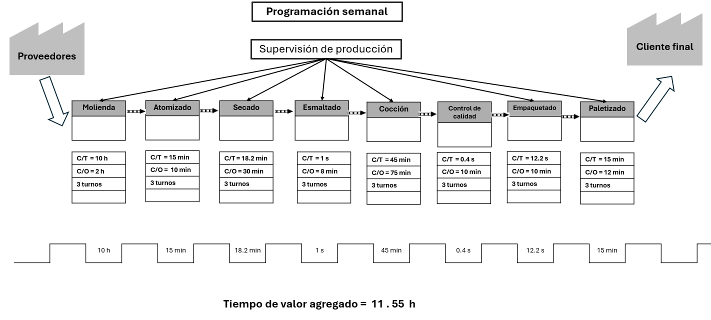
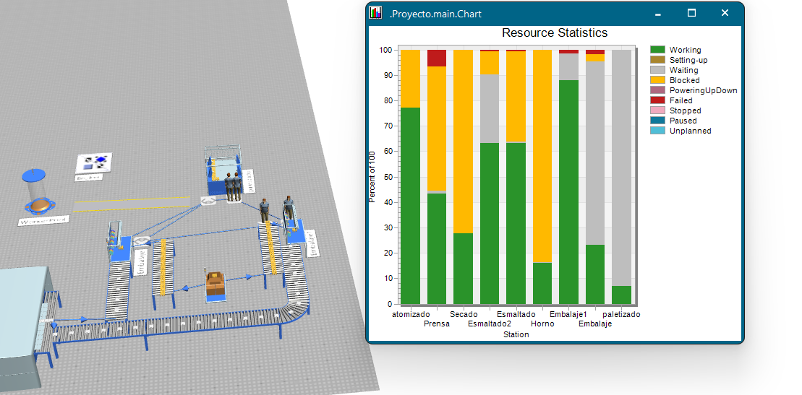
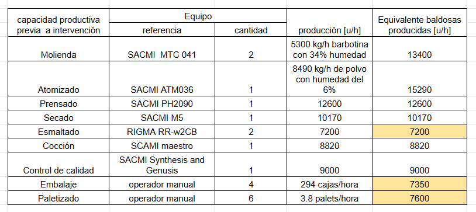
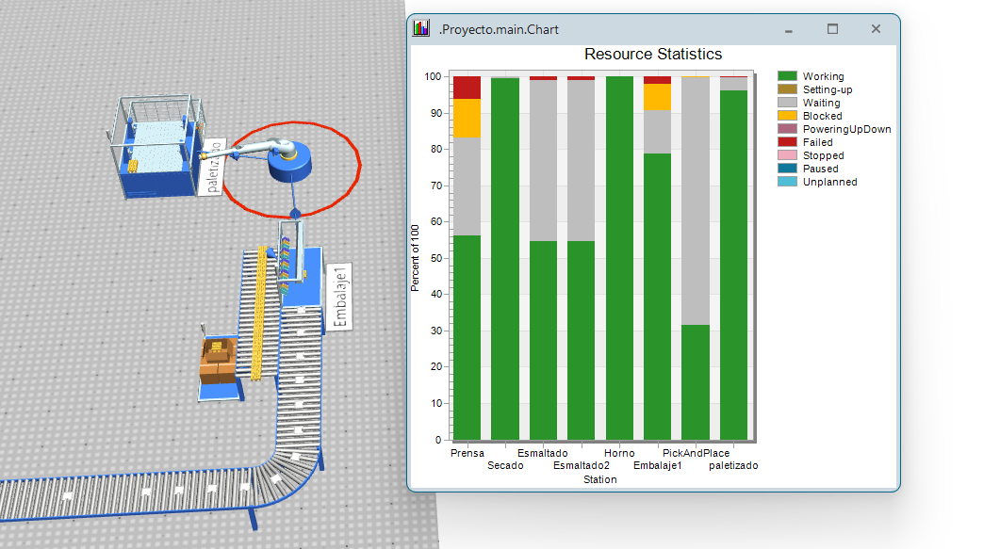
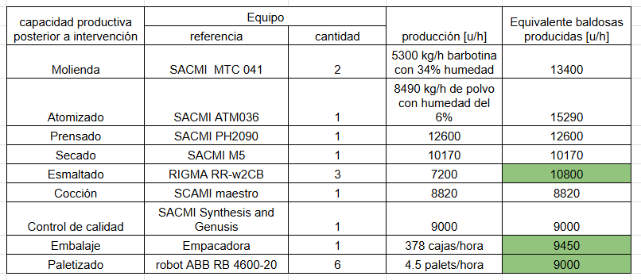

# Gestion de producción 

El análisis de la gestión de producción se realiza utilizando la información recopilada sobre la capacidad productiva de cada proceso.

## VSM (Value Stream Mapping)
Basado en la información previa se puede establecer los tiempos de ciclo (T/C) y los change over o setup times (C/O) que requieren cada proceso. Por facilidad estos son representados en un un mapa de flujo de valor para identificar los procesos con mayor potencial de mejora y candidatos a ser automatizados.

## Calidad 

Basado en el siguiente reporte y tomando un parámetro de calidad estimado de 90% se obtiene la calidad correspondiente a cada uno de cada uno de los procesos según su respectiva prevalencia en los defectos encontrados por el reporte:

> Entre las 588 muestras obtenidas, los defectos incluyen tipos de grietas (60,9%), esquinas rotas (9,9%), defectos de impresión y decoración (9,4%), bordes rotos (8%), defectos en el esmaltado inferior (5,4%), sombras ( 3,9%) y otros casos (2,6%). Teniendo en cuenta las cuestiones anteriores, se analizó el parámetro de tipos de grietas como la principal causa de creación de defectos en las baldosas, que se asoció con las máquinas de prensado
> Tomado de [1]

* grietas -> prensado : Q = 93.90 %
* esquinas rotas, bordes rotos -> empaquetado: Q = 98.1%
* defectos de impresión y decoración -> decoración : Q = 99.06%
* defectos en el esmaltado inferior, sombras -> esmaltado: Q =99.07%
* otros casos ->  molienda: Q = 99.85% atomizado: Q = 99.85%, secado: Q = 99.85%, cocción: Q = 99.85% 

$Q_A = 0.9390 * 0.981 * 0.9906 * 0.9907 * 0.9985^4 = 0.8986$

## Availability

La disponibilidad o availability hace referencia a la capacidad de un sistema de estar operativo en un momento dado. Se calcula mediante la siguiente fórmula:

$$A = \frac{MTBF}{MTBF +MTTM} $$

Siendo MTBF el tiempo medio entre fallos y MTTM el tiempo medio de mantenimiento o reparación.

## Paradas planeadas y no planeadas

Basado en investigaciones sobre el sector productivo se tiene que es común realizar una parada de 8 horas cada 2 meses por mantenimiento,  por otro lado por paradas generales o overhall de planta se espera tener en promedio una parada de 8 días al año.  Esto se traduce en un promedio de un 1 dia de parada mes. Por lo que los cálculos de producción se realizan en base a 29 días de operación. 

$$A = \frac{29*24}{29*24 + (8 + 1*24)} = 0.956$$

Obteniendo un resultado de un availability del 95.6%. Se asume que la disponibilidad de cada proceso es la misma.

Una vez establecidos estos parámetros se realiza la simulación del proceso utilizando la herramienta *Tecnomatix* y se observa la interacción de los procesos en su conjunto.

## Simulación de la planta previo a la intervención

## Cuellos de botella y áreas de mejora 

En la siguiente tabla se puede ver la capacidad de producción de cada proceso:

Esto nos permite identificar que los cuellos de botella se encuentran en los procesos de esmaltado, empaquetado y paletizado.

## Simulación de la planta posterior a la intervención 

Después de realizar la [propuesta de automatización](4-propuesta) se realiza una nueva simulación de la planta con los nuevos procesos mejorados obteniendo los siguientes resultados.

Igualmente se realiza un video donde se observa la simulación de la planta en su totalidad tanto antes como después de la intervención permitiendo comparar su producción resultante.

<iframe width="560" height="315" src="https://www.youtube.com/embed/2vX36CS_SRg?si=4c0oOeXH0hdLJu_p" title="YouTube video player" frameborder="0" allow="accelerometer; autoplay; clipboard-write; encrypted-media; gyroscope; picture-in-picture; web-share" referrerpolicy="strict-origin-when-cross-origin" allowfullscreen></iframe>

## Indicadores claves de diseño

<embed src="/Tile-Tech/KPI.pdf" type="application/pdf" width="100%" height="600px" />

[KPI](/KPI.pdf)

A continuación se anexan los reportes de la simulación de la planta antes y después de la intervención.

## Reporte de tecnomatix previo a intervención

<iframe src="/Tile-Tech/report_tecnomatix_previous.pdf" type="application/pdf" width="100%" height="600px" ></iframe>

## Reporte de tecnomatix posterior a intervención
<iframe src="/Tile-Tech/report_tecnomatix_after.pdf" type="application/pdf" width="100%" height="600px" ></iframe>

<!---
## Modelos usado en el diseño
- caja de empaque tomado de [Cardboard Insert](https://grabcad.com/library/cardboard-insert-1)
-->

## Referencias
1. 