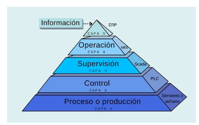

### Industria 4.0: Transformación Digital en la Industria Cerámica

La Industria 4.0, o Cuarta Revolución Industrial, ha traído consigo una transformación significativa en diversos sectores, incluida la industria cerámica. Esta evolución se basa en la integración de tecnologías digitales avanzadas que permiten optimizar y revolucionar los procesos de producción. La industria cerámica, tradicionalmente caracterizada por métodos de producción manuales y semi-automatizados, ha experimentado una metamorfosis considerable gracias a la digitalización. A continuación, se detalla cómo la Industria 4.0 está moldeando el futuro de la producción cerámica.

- Proceso: se logró mejorar la capacidad de producción mediante la instalación de nuevas máquinas y sensores en la línea de producción.

- Control: se tiene la medida de las variables de control de las diferentes etapas del proceso usando los sensores internos de las máquinas, controlador de la celda robótica y de la empacadora.

- Supervisión: No se implementó en el proyecto un sistema SCADA pero las variables de proceso están disponibles fácilmente para la implementación futura del mismo.

- Operación: Desde un principio se asume que la fábrica debido a su tamaño ya cuenta con un software MES para el seguimiento y planeación de la manufactura, sólo es necesario ajustarlo de acuerdo a las nuevas capacidades.

- Información: La información del funcionamiento de las máquinas y de procesos se puede revisar pero no se centraliza ni se analiza automaticamente.

#### Elementos Clave de la Industria 4.0 en la Cerámica

1. **Interconectividad e IoT**: La Internet de las Cosas (IoT) permite conectar máquinas y sistemas de producción cerámicos. Sensores inteligentes y dispositivos conectados recopilan datos en tiempo real, proporcionando información crucial sobre el estado de las máquinas, el consumo de energía y el progreso de la producción. Esta interconectividad facilita el monitoreo continuo y el mantenimiento predictivo, reduciendo tiempos de inactividad y costos operativos.

2. **Automatización Avanzada**: La robótica y la automatización han transformado las líneas de producción cerámica. Robots avanzados se encargan de tareas repetitivas y peligrosas, como la manipulación de materias primas y el esmaltado, aumentando la eficiencia y la seguridad. La automatización también permite una mayor precisión en el control de calidad, asegurando productos finales homogéneos y de alta calidad.

3. **Análisis de Datos y Big Data**: La capacidad de recopilar y analizar grandes volúmenes de datos es fundamental en la Industria 4.0. En la industria cerámica, el análisis de datos puede identificar patrones y tendencias en el proceso de producción, optimizando el uso de recursos y mejorando la toma de decisiones. La inteligencia artificial y el aprendizaje automático se utilizan para predecir fallos en el equipo y optimizar los procesos de producción.

#### Beneficios de la Transformación Digital en la Industria Cerámica

1. **Eficiencia y Productividad**: La automatización y el análisis de datos mejoran significativamente la eficiencia de la producción, reduciendo tiempos de ciclo y aumentando la productividad.

2. **Calidad y Consistencia**: La precisión en el control de calidad y la personalización de productos mediante impresión 3D aseguran productos de alta calidad y consistencia.

3. **Sostenibilidad**: La optimización del uso de recursos y la reducción de desperdicios hacen que los procesos sean más sostenibles, alineándose con las crecientes demandas de responsabilidad ambiental.

4. **Flexibilidad y Personalización**: La capacidad de adaptar rápidamente los procesos y personalizar productos según las demandas del mercado otorga a las empresas cerámicas una ventaja competitiva.

5. **Seguridad y Mantenimiento**: La interconectividad y el monitoreo continuo mejoran la seguridad laboral y permiten un mantenimiento predictivo, reduciendo fallos inesperados y tiempos de inactividad.

### Filosofia Grupal:

Nuestro equipo trabajó bajo el fundamento de que la transformación digital industrial es una mentalidad que debe tenerse para el desarrollo de proyectos de automatización, donde se debe armar un plan de mejora continuo en los procesos con mejoras incrementales que contribuyan a la eficiencia de la planta y a una mejor recopilación y uso de los datos de producción que resultan de cada uno de los procesos para poder seguir iterando y/o encontrando nuevas oportunidades de mejora. Esta mentalidad debe llevarse desde los niveles de producción mediante la implementación y mejora de la maquinaria usando la automatización industrial como una herramienta más que como un fin, se debe automatizar con un propósito y debe permear la totalidad de la planta, incluida la gerencia, de forma que se tomen decisiones informadas, usando datos reales y certeros y que permitan seguir en la dirección de una producción eficiente e idealmente sostenible que permita optimizar tiempo y materias primas mientras se minimizan los desperdicios.

### Conclusión

La Industria 4.0 está revolucionando la industria cerámica, transformando sus procesos tradicionales en operaciones más eficientes, flexibles y sostenibles. La adopción de tecnologías digitales no solo mejora la calidad y la productividad, sino que también posiciona a las empresas cerámicas en la vanguardia de la innovación industrial. La transformación digital es, sin duda, el camino hacia un futuro más brillante y competitivo para el sector cerámico.
